**scSidekick** is a single-cell RNA-seq and spatial transcriptomics toolkit built
on top of [Seurat](https://satijalab.org/seurat/). It extends the ecosystem in four
specific directions that existing companion packages don't fully cover: honest-by-default
comparison plots with shared scales, one consistent faceting grammar spanning both
visualization *and* downstream analysis, project-wide color and layout consistency
registered once on the object, and the same calls scaling without modification from a
pilot study to a multi-million-cell atlas via
[BPCells](https://bnprks.github.io/BPCells/) streaming.

It is fully interoperable with scCustomize, SCpubr, and dittoSeq; the functions here
are not alternatives to those packages but additions targeted at gaps they leave.


```
~~~~~~~~~~~~~~~~~~~~~~~~~~~~~~~~~~~~~~~~~~~~~~~~~~~~~~~

           ___   _      _         _  __  _        _   
 ___  __  / __| (_)  __| |  ___  | |/ / (_)  __  | |__
(_-< / _| \__ \ | | / _` | / -_) | ' <  | | / _| | / /
/__/ \__| |___/ |_| \__,_| \___| |_|\_\ |_| \__| |_\_\

     Your New Best Friend in Visualization

 ✨  It's a good day to make pretty figures!  ✨
~~~~~~~~~~~~~~~~~~~~~~~~~~~~~~~~~~~~~~~~~~~~~~~~~~~~~~~

```

---

## Installation

```r
# install.packages("devtools")
devtools::install_github("nourabdelfattah/scSidekick")
```

---

## ✨ What scSidekick Provides

Every example below is reproducible from public data
([`data-raw/make_readme_figures.R`](data-raw/make_readme_figures.R)).

### 1 · Shared, accurate colour scales across split feature panels

Splitting a feature plot by a condition is the single most common comparison in
single-cell work — and by default a single legend is placed ambiguously across
panels, and that shared scale can be lost when a custom palette is supplied.
`PlotFeaturePlots()` locks **one shared, labelled colour scale** across every
panel so the comparison is honest. No per-call workarounds needed.

**Panel A — split by a single variable:**

<table>
<tr>
<td width="50%" align="center"><b>Without shared scale — ambiguous comparison</b></td>
<td width="50%" align="center"><b>PlotFeaturePlots — one shared, labelled scale</b></td>
</tr>
<tr>
<td>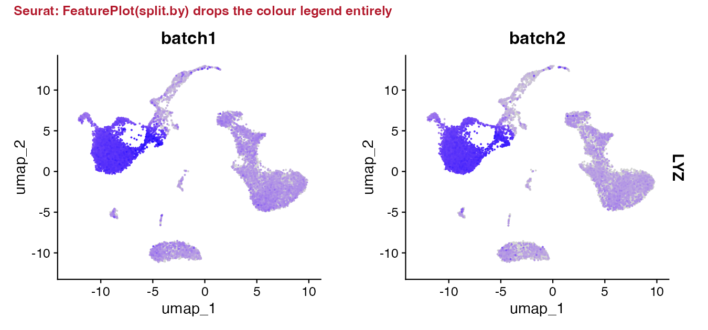</td>
<td>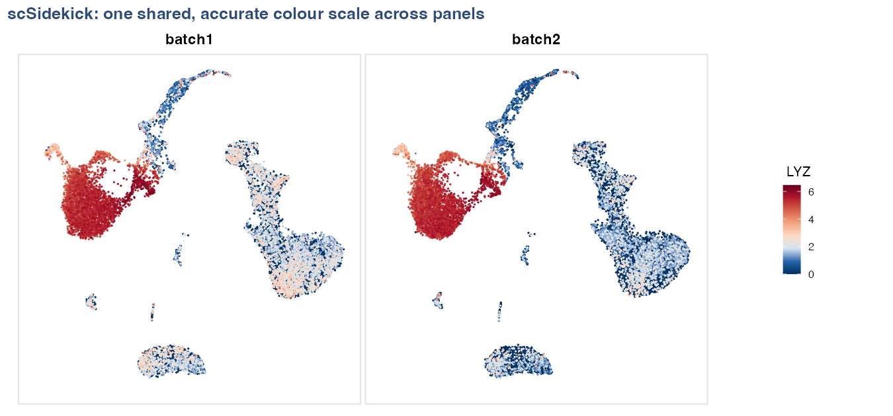</td>
</tr>
</table>

```r
# Panel A: split by donor — one shared colour bar
PlotFeaturePlots(bmcite, features = "LYZ", split.by = "donor")
```

**Panel B — split by lane, arranged in rows by donor (metadata layout):**

When samples cross two variables (e.g., lane × donor), `row.by` adds a second
faceting dimension and `layout_method = "metadata"` aligns panels by their
actual metadata coordinates rather than wrapping them in arbitrary order — so
the grid itself tells the story.

```r
# Panel B: lane on columns, donor on rows, positionally aligned
PlotFeaturePlots(bmcite, features = "LYZ",
                 split.by = "lane", row.by = "donor",
                 layout_method = "metadata")
```

<p align="center">
  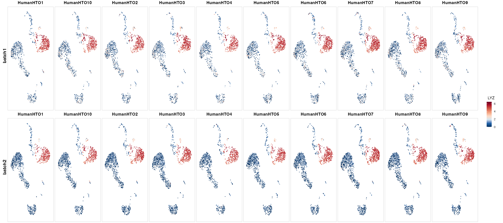
</p>

---

### 2 · Gene-expression dot plots, organized for comparison

#### `SplitDotPlot()` — expression first, organized by gene group

Standard Seurat split dot plots color each dot by the split identity rather than
by expression and interleave rows, making it hard to read expression magnitude.
`SplitDotPlot()` keeps **colour = expression, size = % expressed**, organizes
genes into labelled cell-type blocks, and facets cleanly by condition so every
cluster is comparable across conditions at a glance.

<table>
<tr>
<td width="50%" align="center"><b>Standard split dot plot — expression not directly visible</b></td>
<td width="50%" align="center"><b>SplitDotPlot — blocks, facets, one expression scale</b></td>
</tr>
<tr>
<td>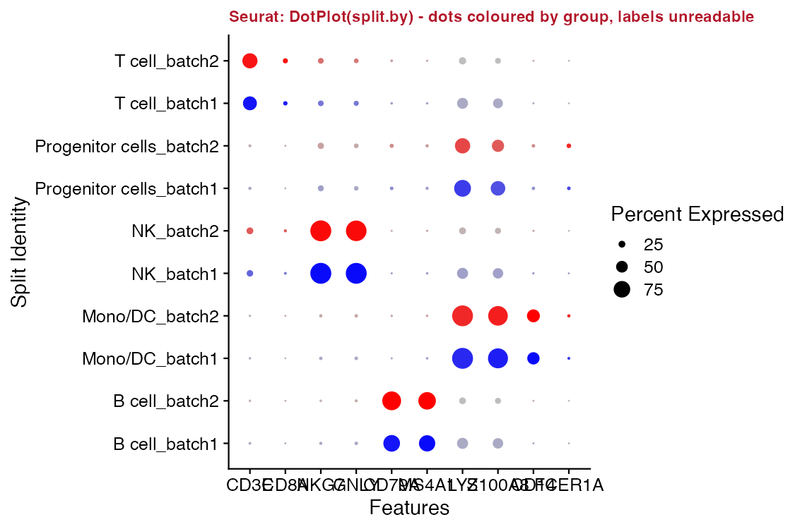</td>
<td>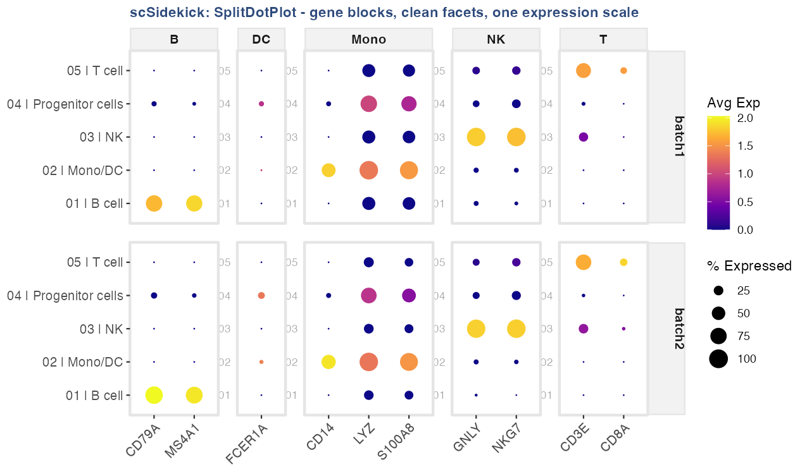</td>
</tr>
</table>

```r
SplitDotPlot(bmcite, markers_df = markers_df,
             group.by = "celltype.l1", split.by = "donor")
```

#### `FastDotPlot()` — find gene programs without knowing gene names

`FastDotPlot()` adds two capabilities that matter when exploring large gene sets:
a **regex pattern** selects all matching genes automatically (no manual list
required), and `k_genes` slices the gene dendrogram into labelled programs so
co-regulated blocks become visible immediately.

```r
# All CD1x/CD2x genes, automatically split into 3 co-expression patterns
FastDotPlot(bmcite,
            pattern  = "^CD[1-2]",
            group.by = "celltype.l1",
            k_genes  = 3)
```

<p align="center">
  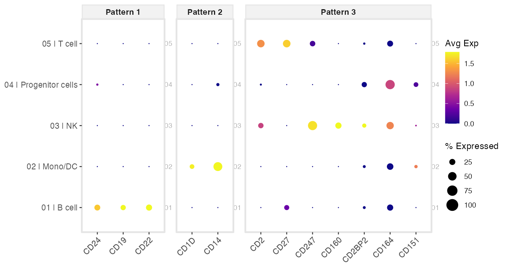
</p>

Pair with `FastDotPlot2()` to add an automatic **EnrichR annotation header**
above each gene-pattern panel — pattern → pathway in one call:

```r
FastDotPlot2(bmcite, pattern = "^CD[1-2]", group.by = "celltype.l1",
             k_genes = 3, EnrichR_DB = "CellMarker_2024")
```

---

### 3 · Multi-cohort cell-cell communication — keep every cohort visible

`CompareCellChat()` places every cohort on **one shared layout** with the same
node colours and group order in every panel, so you compare presence *and*
absence side by side. Cohorts where a pathway is absent get a blank panel
rather than being silently dropped — absence is often the finding.

<p align="center">
  <b>Standard comparison — cohorts lacking a pathway are silently omitted</b><br>
  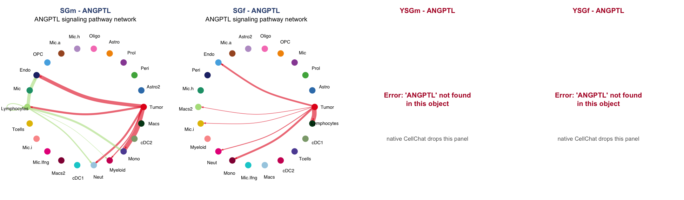
</p>

<p align="center">
  <b>CompareCellChat — every cohort shown; same colours, same order, absence visible</b><br>
  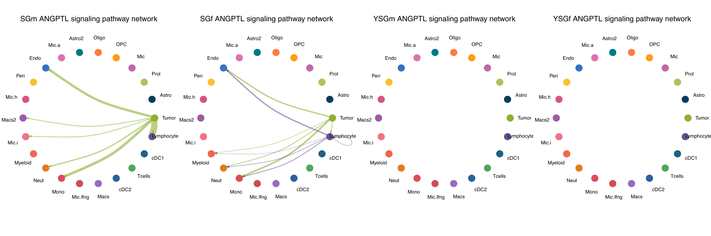
</p>

```r
CompareCellChat(
  list(SGm = "SGmCellChat.rds",  SGf = "SGfCellChat.rds",
       YSGm = "YSGmCellChat.rds", YSGf = "YSGfCellChat.rds"),
  output_dir = "./Figures/CellChat")
```

---

### 4 · Atlas-scale metadata, summarized in one line

`PlotMetaSummary()` computes cell-type composition across multiple grouping
levels — counts *and* percentages — in a single expression:

<p align="center">
  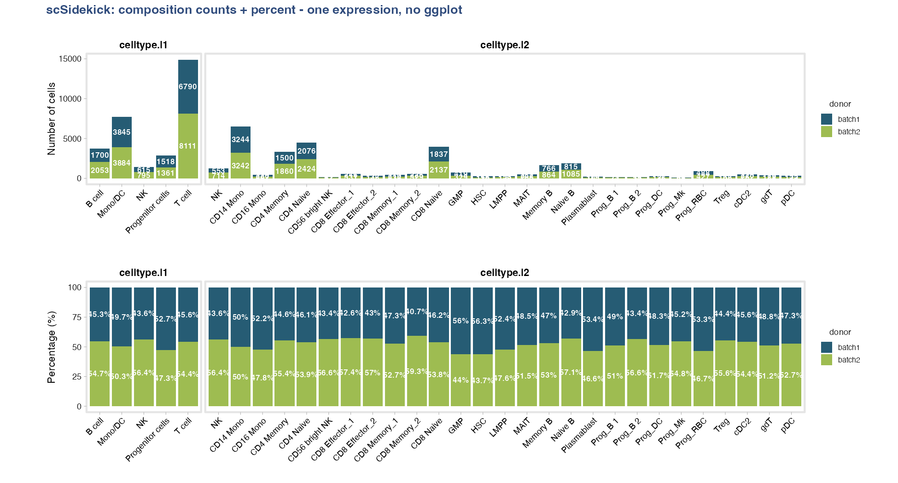
</p>

```r
PlotMetaSummary(obj, variables = c("celltype.l1", "celltype.l2"),
                fill_variable = "donor", count_unit = "cells") +
PlotMetaSummary(obj, variables = c("celltype.l1", "celltype.l2"),
                fill_variable = "donor", count_unit = "cells", percent = TRUE)
```

The same function handles a 1.78M-cell, 153-column clinical atlas: point it at a
data frame with `id_column = "Donor.ID"` and it collapses cells to donors and
lays out the clinical variables — no manual aggregation:

<table>
<tr>
<td width="42%" align="center"><b>153 raw metadata columns — hard to interpret at scale</b></td>
<td width="58%" align="center"><b>83 donors summarised in one line</b></td>
</tr>
<tr>
<td>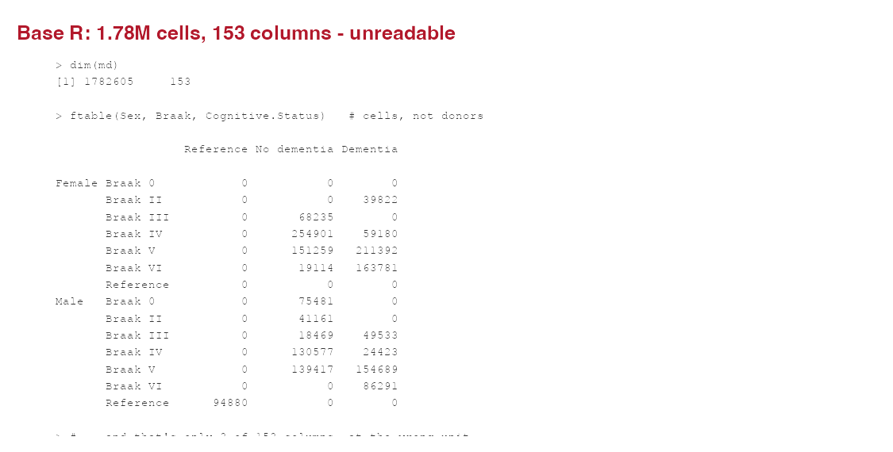</td>
<td>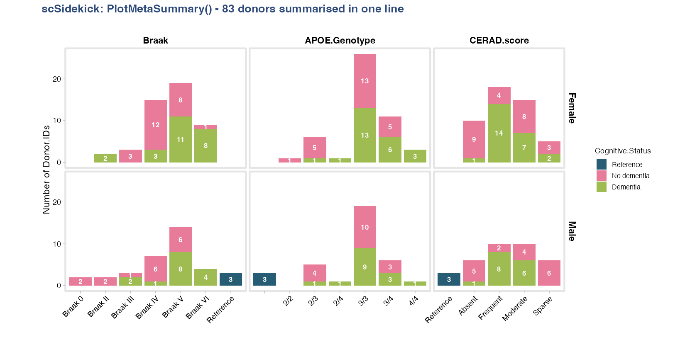</td>
</tr>
</table>

```r
PlotMetaSummary(md, id_column = "Donor.ID",
                variables = c("Braak", "APOE.Genotype", "CERAD.score"),
                fill_variable = "Cognitive.Status", row_variable = "Sex")
```

---

### 5 · Methods paragraph + figure legends, written as you go

Every figure-writing function drops a plain-text **legend sidecar** (`.legend`)
next to the figure file as it's saved. `ExtractMethods()` reads the Seurat
command history into a **ready-to-paste methods paragraph**. Nothing to
reconstruct months later.

```r
# Auto-written next to every figure, e.g. "LYZ_donor featuremap bmcite.legend":
#   UMAP feature plot showing expression of LYZ in bmcite, split by donor.
#   Colour scale: low (dark blue) to high (dark red), capped at the per-gene
#   maximum (6.46). Each panel represents one donor level; legend shows the
#   shared colour bar.

ExtractMethods(obj)$methods_text
#> Single-cell RNA-seq (scRNA-seq) data (30,672 cells, 17,009 genes; assay: RNA)
#> were analyzed using Seurat. Gene expression counts were normalized using
#> LogNormalize (scale factor 10,000) and 2,000 highly variable genes were
#> identified using the vst method. PCA was performed (30 PCs computed). ...
```

---

### 6 · Analysis to slides in one call

`create_analysis_pptx()` walks a figures directory (including per-subfolder
parameters) and assembles a PowerPoint deck — aspect-ratio-preserving figure
placement, section ordering, the works:

```r
create_analysis_pptx(output_dir = "./Figures", object_name = "MyProject")
```

---

### 7 · Gene-set enrichment, with keyword pathway search

One call runs the ranking, GSEA against Hallmark / KEGG / Reactome / WikiPathways,
and the enrichment plots:

```r
RunGSEA(obj, group.by = "seurat_clusters", output_dir = "./Figures/Pathways")
```

**Nested comparisons are two arguments.** `split.by` runs an independent GSEA per
level — one per major lineage, comparing subtypes within it:

```r
RunGSEA(obj,
        group.by   = "celltype.l2",   # subtypes compared
        split.by   = "celltype.l1",   # nested: one run per lineage
        output_dir = "./Figures/Pathways")
```

**No need to know exact pathway names.** Pull pathways by keyword, then see
which genes drive them:

```r
PlotGSEAEnrichment(output_dir = "./Figures/Pathways",
                   search_terms = list(c("interferon", "response"), "apoptosis"))

VisualizeLeadingEdge(obj, gsea_files = "./Figures/Pathways",
                     search_terms = "interferon", group.by = "celltype.l1")
```

For sample-level robustness or per-cell scores on a large object,
`RunGSEA_pseudobulk()` and `RunSCssGSEA()` stream BPCells / sketched assays.

---

## One faceting vocabulary, everywhere

The same three arguments work across every function — plots *and* analyses:

- **`group.by`** — what defines a group (colour, x-axis, the comparison)
- **`split.by`** — make one panel / one independent run per level
- **`row.by`** — arrange panels along a second dimension

```r
PlotDimPlots(obj,        group.by = "CellType", split.by = "Sample")
PlotFeaturePlots(obj,    features = "CD3E",     split.by = "Condition")
SplitDotPlot(obj,        markers_df = m, group.by = "CellType", split.by = "Condition")
PlotMetaSummary(obj,     variables = "CellType", fill_variable = "Group", row_variable = "Sex")
RunGSEA(obj,             group.by = "celltype.l2", split.by = "celltype.l1")
RunCellChat(obj,         group.by = "CellType",    split.by = "Condition")
```

Same words whether you are drawing a UMAP, a dot plot, or running GSEA and
CellChat. Learn the grammar once; it carries over to every step.

---

## Why scSidekick

- **Honest-by-default plots** — shared scales and kept legends by design, so
  comparisons are valid without per-call workarounds.
- **Consistency for free** — register colours, factor levels, and defaults once
  with `PrepObject()`; every downstream function reads them, so an entire project
  shares one palette and layout.
- **Reproducibility captured passively** — a legend sidecar for every figure, an
  auto-drafted methods paragraph, a one-call PPTX builder, and a session logger
  that turns a working session into a clean script.
- **Scales to big data** — feature plots, pseudobulk, and pathway scoring stream
  BPCells / on-disk / Sketch assays; the same one-liners work on a 2M-cell atlas.

---

## Quick start

```r
library(scSidekick)
library(Seurat)

# Register colours, levels, and defaults once:
obj <- PrepObject(obj,
  variables   = c("Sample", "Group", "seurat_clusters"),
  group.by    = "seurat_clusters",
  split.by    = "Sample",
  output_dir  = "./Figures",
  object_name = "MyProject")

# Every downstream function reads those defaults automatically:
PlotDimPlots(obj)                                   # UMAP split by Sample
PlotMetaSummary(obj, variables = "seurat_clusters", # composition at a glance
                fill_variable = "Group", count_unit = "cells")
PlotFeaturePlots(obj, features = c("CD3E", "CD79A", "LYZ"))
GroupHeatmap(obj, features = marker_genes)
RunGSEA(obj, group.by = "seurat_clusters")
create_analysis_pptx(output_dir = "./Figures", object_name = "MyProject")
```

---

## What's inside

| Category | Key functions |
|---|---|
| **Setup & Colours** | `GenerateDirectories()`, `PrepObject()`, `ShowColors()`, `GetColors()`, `SetLevels()`, `RenameClusters()`, `Nour_pal()`, `scale_color_Nour()` |
| **Metadata** | `SummarizeMetadata()`, `PlotMetaSummary()` |
| **Dim. reduction** | `Determine_nDims()` |
| **UMAP & composition** | `PlotDimPlots()`, `PlotTrendAndUMAP()`, `PlotComposition()`, `PlotPieUMAP()`, `PlotTrendLabeled()` |
| **Composition charts** | `PlotAlluvial()`, `PlotRose()`, `PlotChord()`, `PlotAtlasWheel()` |
| **Feature expression** | `PlotFeaturePlots()`, `PlotFeature()`, `PlotMultiFeature()` |
| **Heatmaps & dot plots** | `GroupHeatmap()`, `SplitDotPlot()`, `SplitDotPlot2()`, `FastDotPlot()`, `FastDotPlot2()`, `StackedVlnPlot()` |
| **Marker discovery** | `RunWilcoxAUC()` |
| **Differential expression** | `PlotVolcano()`, `PlotEnrichment()`, `PlotGSEAEnrichment()`, `VisualizeLeadingEdge()` |
| **Pseudobulk (large data)** | `ComputePseudobulk()`, `PlotPseudoBulk()` |
| **Pathway analysis** | `RunGSEA()`, `RunGSEA_pseudobulk()`, `RunSCssGSEA()`, `RunEnrichment()` |
| **Cell-cell communication** | `RunCellChat()`, `CompareCellChat()`, `RankCellChatPathways()` |
| **Cell annotation** | `CellTypeAssignmentHelper()` |
| **Spatial** | `PlotSpatialDimPlots()`, `PlotSpatialFeaturePlots()`, `PlotMasterMaps()` |
| **QC & loading** | `PlotQCMetrics()`, `LoadSamplesRNA()` |
| **Reporting & logging** | `create_analysis_pptx()`, `ExtractMethods()`, `log_figure_legend()`, `start_session_logger()`, `summarize_r_session()`, `theme_NourMin()` |

---

## Documentation

Full vignettes and function reference at
**[nourabdelfattah.github.io/scSidekick](https://nourabdelfattah.github.io/scSidekick/)**

| Vignette | Topic |
|---|---|
| 01 | Getting started — `PrepObject`, colours, metadata |
| 02 | Dimensionality reduction |
| 03 | UMAP visualization |
| 04 | Feature expression |
| 05 | Heatmaps & dot plots |
| 06 | Cell annotation |
| 07 | Spatial transcriptomics |
| 08 | Pathway analysis |
| 09 | Cell-cell communication |
| 10 | Reporting & utilities |
| 11 | Metadata & composition |
| 12 | Large datasets |
