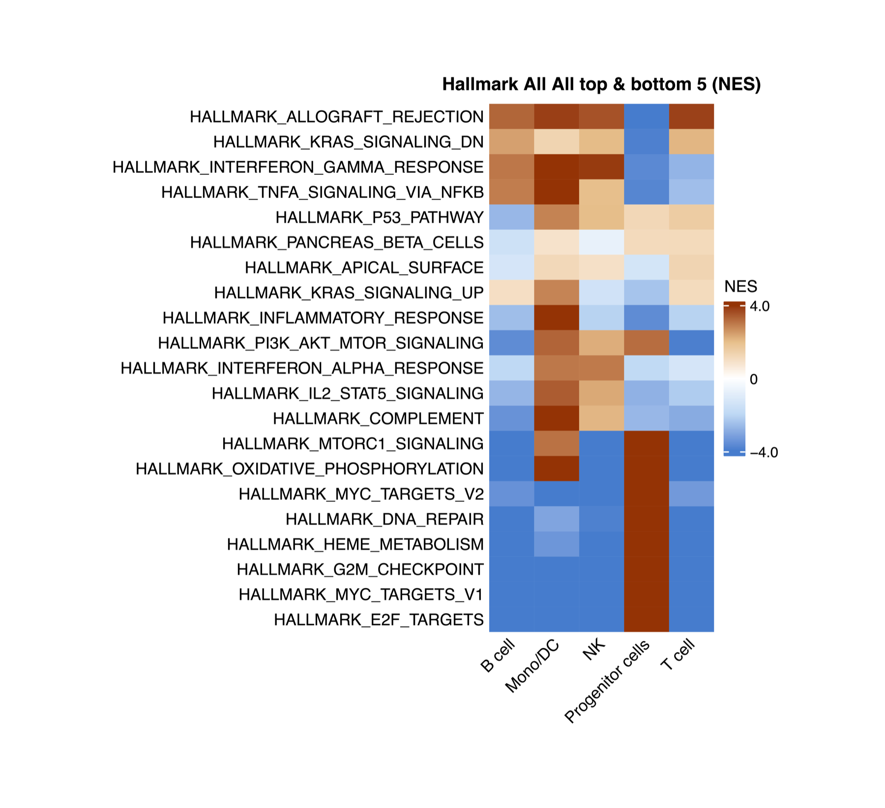
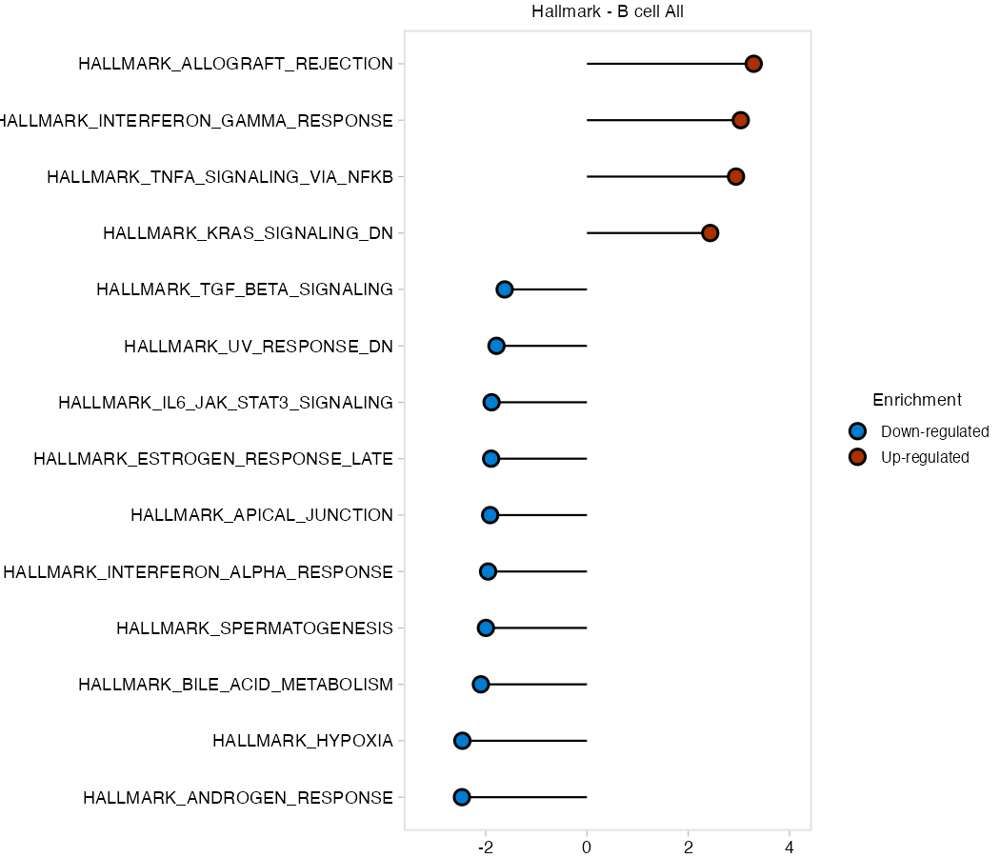

```{r setup, include=FALSE}
knitr::opts_chunk$set(echo = TRUE, eval = FALSE, message = FALSE, warning = FALSE)
```

## Overview

`RunGSEA()` performs gene set enrichment analysis (GSEA) on a Seurat object.
It handles the full pipeline internally:

1. Subset by `split.by` (e.g. one GSEA per broad cell type)
2. Run Wilcoxon DE with `RunWilcoxAUC()`, grouped by `group.by`
3. Run `fgsea` against one or more MSigDB collections
4. Save lollipop plots (top/bottom pathways per group) and NES heatmaps as PDFs

No pre-computed DE table is needed - just pass the Seurat object.

For sample-level pseudobulk GSEA with limma-voom contrasts, see
**Vignette 09: `RunGSEA_pseudobulk`**.

---

## Standard setup

```{r standard-setup, eval=FALSE}
library(scSidekick)
library(Seurat)
library(SeuratData)
library(dplyr)

data("bmcite")
bmcite <- UpdateSeuratObject(bmcite)
bmcite <- bmcite %>%
  NormalizeData() %>% FindVariableFeatures() %>% ScaleData() %>% RunPCA()
dims <- Determine_nDims(bmcite, elbow_plot = FALSE)
bmcite <- RunUMAP(bmcite, dims = 1:dims$n_dims)
bmcite <- FindNeighbors(bmcite, dims = 1:dims$n_dims)
bmcite <- FindClusters(bmcite, resolution = 0.5)
bmcite <- PrepObject(bmcite,
  variables   = c("lane", "donor", "celltype.l1", "celltype.l2", "seurat_clusters"),
  group.by    = "celltype.l1",
  split.by    = "donor",
  output_dir  = tempdir(),
  object_name = "bmcite")
```

---

## 1. Basic call

```{r gsea-basic, eval=FALSE}
res <- RunGSEA(bmcite,
  group.by   = "celltype.l1",
  split.by   = NULL,
  output_dir = tempdir())
```

You will get  a subfolder per geneset dataset and inside you will have heatmaps comparing the NES per group and lollipop plots for each group separately,legeneds and source tables are also saved
<p align="center">
  
</p>

```{r loadres, echo=FALSE, eval=TRUE, include=FALSE}
# Cached from a real RunGSEA() run so the vignette shows genuine output
# without paying for the full DE + fgsea computation on every build. Paths
# are relative to this .Rmd's own location (vignettes/), which knitr always
# uses as the working directory - so this works from any checkout, not just
# one machine's folder layout.
load("figures/gsea_cache.rdata")
analysis_params_json_path <- "figures/analysis_params.json"
run_fingerprint_json_path <- "figures/run_fingerprint.json"

# Reconstitute a minimal stand-in for the real `res` object so the "Return
# value" section below can use the exact same res$All$All$Hallmark$... code a
# user would type against a live run - de_table_head is already head(de_table)
# so head()'ing it again below is a no-op, and nes_matrix_cached/lollipop_names
# are the real, unmodified values from that run.
res <- list(All = list(All = list(Hallmark = list(
  de_table       = de_table_head,
  nes_matrix     = nes_matrix_cached,
  lollipop_plots = stats::setNames(vector("list", length(lollipop_names)), lollipop_names)
))))
```

```{r lollipop plots, echo=FALSE, eval=TRUE, results='asis'}
cat('<p align="center"></p>\n')
```
`group.by` defines the groups being compared (e.g. cell types, clusters).
`split.by = NULL` runs a single GSEA on the whole object. Set `split.by` to
a broad cell-type column (e.g. `"celltype.l1"`) to run GSEA separately within
each major lineage.

By default `RunGSEA` tests four MSigDB collections: Hallmark, KEGG, Reactome,
and WikiPathways.

### What gets saved alongside the plots

Every run also writes two small JSON files into its own timestamped run
folder under `output_dir`, so a figure is never separated from exactly how it
was made:

- **`analysis_params.json`** - the literal function call as typed, every
  parameter that was actually used, and a ready-to-paste methods paragraph.
- **`run_fingerprint.json`** - the parameter fingerprint `resume`/`resume_folder`
  match against to detect a repeat run, so re-running with the same settings
  reuses the existing output instead of recomputing it.

```{r gsea-json, eval=TRUE, echo=F, results='asis'}
cat("**`analysis_params.json`**")
cat("\n```\n")
cat("json\n")
cat(readLines(analysis_params_json_path), sep = "\n")
cat("\n```\n")

cat("**`run_fingerprint.json`**")
cat("\n```\n")
cat("json\n")
cat(readLines(run_fingerprint_json_path), sep = "\n")
cat("\n```\n")
```

---

## 2. Split by broad cell type

The most common use: compare detailed subtypes (`celltype.l2`) within each
major lineage (`celltype.l1`).

```{r gsea-split}
res <- RunGSEA(bmcite,
  group.by   = "celltype.l2",
  split.by   = "celltype.l1",
  output_dir = tempdir())

```

This produces one independent GSEA per level of `celltype.l1`. For each,
DE is computed between `celltype.l2` groups and pathways are ranked by NES.

---

## 3. Custom pathway collections

Supply any combination of MSigDB collections via `pathway_sets`. Each element
needs a `category` and an optional `subcategory`.

```{r gsea-custom-sets}
res <- RunGSEA(bmcite,
  group.by     = "celltype.l1",
  split.by     = NULL,
  output_dir   = tempdir(),
  pathway_sets = list(
    Hallmark    = list(category = "H"),
    ImmuneSigDB = list(category = "C7", subcategory = "IMMUNESIGDB"),
    GO_BP       = list(category = "C5", subcategory = "GO:BP")
  ))
```

Run `msigdbr::msigdbr_collections()` to see all available collections.

---

## 4. Mouse datasets

```{r gsea-mouse}
res <- RunGSEA(brain,
  group.by   = "seurat_clusters",
  split.by   = NULL,
  species    = "Mus musculus",
  output_dir = tempdir())
```

---

## 5. Adjusting thresholds

`padj_thresh` and `logfc_thresh` filter DE results before ranking.
`top_n` controls how many pathways appear per group in summary heatmaps.

```{r gsea-thresholds}
res <- RunGSEA(bmcite,
  group.by      = "celltype.l1",
  split.by      = NULL,
  padj_thresh   = 0.01,
  logfc_thresh  = 0.25,
  top_n         = 10L,
  output_dir    = tempdir())
```

---

## 6. Resuming a long run

`resume = TRUE` skips subsets for which output files already exist in
`output_dir`. Essential when restarting a run that was interrupted.

```{r gsea-resume}
res <- RunGSEA(bmcite,
  group.by   = "celltype.l2",
  split.by   = "celltype.l1",
  output_dir = tempdir(),
  resume     = TRUE)
```

---

## 7. Customizing heatmap colors

By default NES heatmaps use a 5-stop diverging palette centered at 0
(blue - light blue - white - light orange - orange-red). Override with any
`circlize::colorRamp2` object via `heatmap_colors`.

```{r gsea-colors}
# Classic blue-white-red (3-stop)
col_bwr <- circlize::colorRamp2(c(-3, 0, 3), c("#2166ac", "white", "#d6604d"))

# Purple-green (PRGn)
col_prg <- circlize::colorRamp2(
  c(-3, -1.5, 0, 1.5, 3),
  c("#762a83", "#c2a5cf", "white", "#7fbf7b", "#1b7837"))

# Tighter scale for subtle signals
col_tight <- circlize::colorRamp2(c(-1.5, 0, 1.5),
                                   c("#007dd1", "white", "#ab3000"))

res <- RunGSEA(bmcite,
  group.by       = "celltype.l1",
  split.by       = NULL,
  output_dir     = tempdir(),
  heatmap_colors = col_bwr)
```

---

## 8. Return value

`RunGSEA` returns a nested list, three levels deep: `res[[label.by level]][[split.by
level]][[pathway_sets name]]`. When `label.by`/`split.by` are `NULL` (as in
the basic call above), both default to a single `"All"` level, so the whole
object's Hallmark result sits at `res$All$All$Hallmark`. Each of those leaf
lists holds:

```{r gsea-return, eval=TRUE}
# Per-cell-type DE table that fed into fgsea
head(res$All$All$Hallmark$de_table)

# Group x pathway NES matrix (what the summary heatmap is drawn from)
res$All$All$Hallmark$nes_matrix[1:5, ]

# Named list of lollipop ggplots, one per group.by level
names(res$All$All$Hallmark$lollipop_plots)
```

---

## 9. Finding pathways by keyword - `PlotGSEAEnrichment()`

A GSEA run returns hundreds of pathways with long, exact MSigDB names. You
should not have to know that the apoptosis pathway is called
`HALLMARK_APOPTOSIS`. `PlotGSEAEnrichment()` auto-discovers the result CSVs and
selects pathways by **keyword search** instead.

> **Pain point fixed.** Describe the biology, not the exact string. Pass a
> **character vector for OR** logic, or a **list of vectors for AND-groups**
> (which are then OR'd) - all case-insensitive regex.

```{r gsea-keyword}
# OR: any pathway mentioning "apoptosis" OR "cell_death"
PlotGSEAEnrichment(
  output_dir   = "./Figures/Pathways",
  search_terms = c("apoptosis", "cell_death"))

# AND-group: pathways mentioning BOTH "interferon" AND "response"
PlotGSEAEnrichment(
  output_dir   = "./Figures/Pathways",
  search_terms = list(c("interferon", "response")))

# Mixed: (T_cell AND activation) OR inflammation
PlotGSEAEnrichment(
  output_dir   = "./Figures/Pathways",
  search_terms = list(c("t_cell", "activation"), "inflammation"))
```

---

## 10. Which genes drive a pathway? - `VisualizeLeadingEdge()`

A significant NES tells you a pathway is enriched, but not *which genes* are
responsible. `VisualizeLeadingEdge()` pulls the **leading-edge genes** for the
pathways you select (by the same keyword search), then draws a per-cell
expression heatmap - and, optionally, a dotplot, stacked violins, and boxplots,
intersected with your DEGs.

> **Pain point fixed.** Go from "this pathway is up" to "these specific genes
> are driving it, in these cells" - visually, in one call.

```{r leading-edge}
VisualizeLeadingEdge(bmcite,
  gsea_files   = "./Figures/Pathways",     # a dir of GSEA CSVs, or file paths
  search_terms = c("interferon"),
  group.by     = "celltype.l1",
  split.by     = "donor",
  output_dir   = "./Figures/LeadingEdge")
```

Supply a DEG table via `deg_df` to intersect leading-edge genes with your
significant differentially expressed genes for a focused, defensible gene set.

---

## Parameter reference

| Parameter | Type | Default | Description |
|-----------|------|---------|-------------|
| `seurat_object` | Seurat | required | Clustered, annotated Seurat object |
| `group.by` | character | `"Assignment"` | Column defining groups for DE comparison |
| `split.by` | character or `NULL` | `"GlobalAssignment"` | Column for independent sub-runs (`NULL` = whole object) |
| `label.by` | character or `NULL` | `NULL` | Outer subsetting column |
| `pathway_sets` | named list | Hallmark + KEGG + Reactome + WP | MSigDB collections to test |
| `species` | character | `"Homo sapiens"` | Species for `msigdbr` |
| `padj_thresh` | numeric | `0.05` | DE/fgsea adjusted p-value cutoff |
| `logfc_thresh` | numeric | `0.1` | Minimum log-fold-change for DE filtering |
| `top_n` | integer | `5` | Top/bottom pathways per group in summary heatmaps |
| `output_dir` | character or `NULL` | `NULL` | Directory for PDFs and CSVs (`NULL` = return only) |
| `resume` | logical | `FALSE` | Skip already-completed subsets |
| `heatmap_colors` | `colorRamp2` or `NULL` | `NULL` | Custom color function for NES heatmaps; `NULL` uses the 5-stop blue-white-orange-red default |
| `heatmap_params` | named list | `list(...)` | Extra arguments forwarded to `ComplexHeatmap::Heatmap()` |
| `width` | numeric or `NULL` | `NULL` | Override the auto-calculated heatmap PDF width in inches |
| `height` | numeric or `NULL` | `NULL` | Override the auto-calculated heatmap PDF height in inches |
| `timestamp` | logical | `TRUE` | Write each run into its own timestamped subfolder under `output_dir` |

---

## See also

- Vignette 05: `GroupHeatmap` - gene-level expression heatmap
- Vignette 06: `CellTypeAssignmentHelper` - annotate clusters before pathway analysis
- Vignette 09: `RunGSEA_pseudobulk` - sample-level pseudobulk GSEA with limma-voom
- Vignette 10: `RunSCssGSEA` - per-cell pathway scoring; `PlotPathwayButterfly` - 4-pathway state hierarchy; `RunEnrichment` - ORA
- Vignette 11: `RunCellChat` - pathway-level cell-cell communication

---

## Session info

```{r session-info}
sessionInfo()
```
